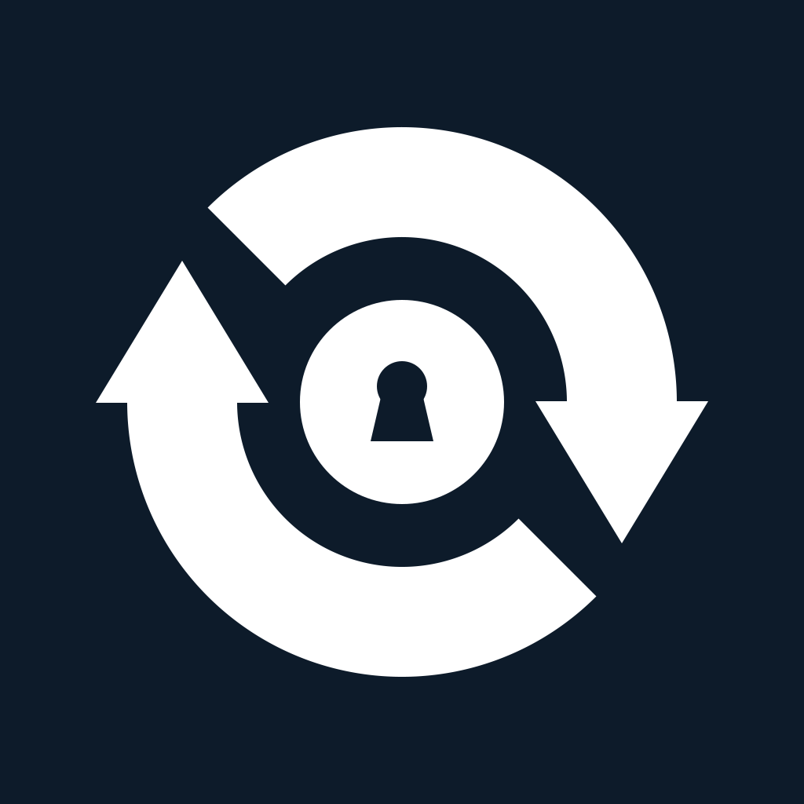

#  VaultSync

[](https://github.com/psimaker/vaultsync/actions/workflows/ci.yml)
[](LICENSE)

Self-hosted Obsidian vault sync for iOS — powered by Syncthing.

## What is VaultSync?

VaultSync synchronizes your [Obsidian](https://obsidian.md) vaults between your devices using [Syncthing](https://syncthing.net)'s proven protocol. It's a self-hosted, open-source alternative to Obsidian Sync.

- **Free on the App Store** — no upfront cost, no feature paywalls
- **Self-hosted** — your data stays on your devices, no third-party cloud
- **Open source** — MPL-2.0 licensed, inspect and contribute on GitHub
- **Obsidian-first** — built for the Obsidian workflow, not a generic sync client

### Cloud Relay (optional but recommended — $0.99/month)

Subscribe to the Cloud Relay for near-realtime push-based sync. When files change on your server, a silent push notification wakes VaultSync immediately — no need to open the app first.

This requires the [vaultsync-notify](notify/) Docker container running alongside Syncthing on your homeserver. The container watches for file changes and sends a wake-up signal to the relay — without it, the relay has no way of knowing when your files changed.

Without the subscription, VaultSync works the same way — just open the app to trigger a sync (completes in seconds for Markdown files) or rely on iOS background refresh.

## How It Works

```
┌──────────────┐     Syncthing protocol      ┌──────────────────┐
│  Your Mac /  │◄───────────────────────────►│    VaultSync      │
│  Linux / NAS │     (LAN or Internet)        │    (iOS)          │
│  + Syncthing │                              │                   │
└──────┬───────┘                              │  Syncs directly   │
       │                                      │  into Obsidian    │
       │  vaultsync-notify                    │  sandbox          │
       │  (Docker sidecar)                    └────────▲──────────┘
       │         │                                     │
       │         │ wake-up signal              APNs    │
       │         ▼                             push    │
       │  ┌──────────────────┐                         │
       │  │ relay.vaultsync  │─────────────────────────┘
       │  │      .eu         │   (Cloud Relay, optional)
       │  └──────────────────┘
```

1. **Syncthing** runs on your desktop/server and syncs files with VaultSync over the Syncthing protocol
2. **VaultSync** receives files directly into Obsidian's sandbox on iOS — open Obsidian and your vault is up to date
3. **vaultsync-notify** (optional) watches your Syncthing instance and signals the Cloud Relay when files change
4. **Cloud Relay** sends a silent push notification to wake VaultSync for immediate sync

## Getting Started

### 1. Install VaultSync

Download VaultSync from the App Store (free).

### 2. Connect Your Syncthing Device

Open VaultSync and scan your desktop Syncthing Device ID via QR code — or enter it manually. Accept the connection on your desktop Syncthing instance.

### 3. Sync Your Vault

VaultSync automatically detects Obsidian vaults. Select which vault to sync and it appears directly in Obsidian on your iPhone or iPad.

### 4. Enable Instant Sync (optional)

For near-realtime sync, subscribe to Cloud Relay ($0.99/month) in the app and run the [vaultsync-notify](notify/) container alongside your Syncthing instance:

```yaml
# Add to your docker-compose.yml
vaultsync-notify:
  image: ghcr.io/psimaker/vaultsync-notify:latest
  environment:
    SYNCTHING_API_URL: http://syncthing:8384
    SYNCTHING_API_KEY: your-api-key
    RELAY_URL: https://relay.vaultsync.eu
```

See [notify/README.md](notify/README.md) for full setup instructions.

## vaultsync-notify

A lightweight Docker sidecar that watches your Syncthing instance for file changes and triggers push notifications to your iOS device. Only the Syncthing Device ID is sent as a wake-up signal — **no file names, folder names, or content ever leaves your server**.

See [notify/README.md](notify/README.md) for details.

## Troubleshooting and Operations

- [docs/troubleshooting.md](docs/troubleshooting.md) — End-user troubleshooting for common failures

## Self-Hosted Relay

A fully self-hosted relay option (replacing `relay.vaultsync.eu` with your own server) is planned for a future release. In the meantime, the app works without any relay via manual sync and iOS background refresh.

## Technical Details

| | |
|---|---|
| **Platform** | iOS 26+ |
| **Language** | Swift 6 (strict concurrency), SwiftUI |
| **Sync engine** | Syncthing v2.x via gomobile (.xcframework) |
| **Background sync** | BGAppRefreshTask + BGContinuedProcessingTask |
| **Push sync** | APNs silent notifications via Cloud Relay |
| **License** | MPL-2.0 |

## Building from Source

**Requirements:** Xcode 26+, Go 1.23+ with gomobile, Make

```bash
git clone https://github.com/psimaker/vaultsync.git
cd vaultsync

# Build the Go xcframework
make xcframework

# Open in Xcode
open ios/VaultSync.xcodeproj
```

See [docs/setup.md](docs/setup.md) for detailed build instructions.

## Project Structure

```
├── ios/                  # Swift/SwiftUI iOS app
├── go/                   # Go bridge (gomobile → .xcframework)
├── notify/               # vaultsync-notify Docker container
├── docs/                 # Architecture and setup docs
└── .github/workflows/    # CI pipeline
```

## Contributing

Contributions are welcome. Please follow the project conventions (Swift API Design Guidelines, standard Go conventions, Conventional Commits) and open a PR with a description.

- [docs/setup.md](docs/setup.md) — Build instructions
- [docs/architecture.md](docs/architecture.md) — Codebase structure
- [docs/troubleshooting.md](docs/troubleshooting.md) — Common runtime failures and exact fixes

## Acknowledgments

- [Syncthing](https://syncthing.net/) — the open-source file synchronization program powering VaultSync
- [gomobile](https://github.com/golang/mobile) — Go on mobile

## License

[MPL-2.0](LICENSE) — You may freely use, modify, and distribute this software under the terms of the Mozilla Public License 2.0.
