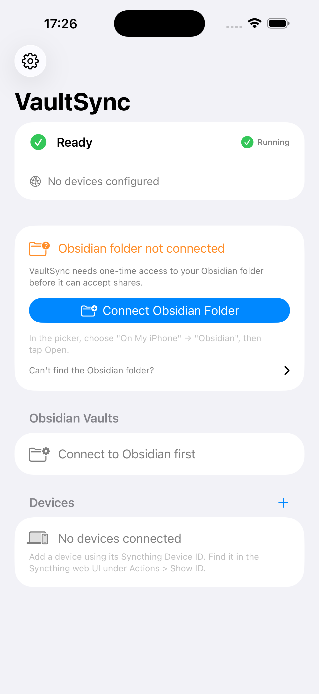
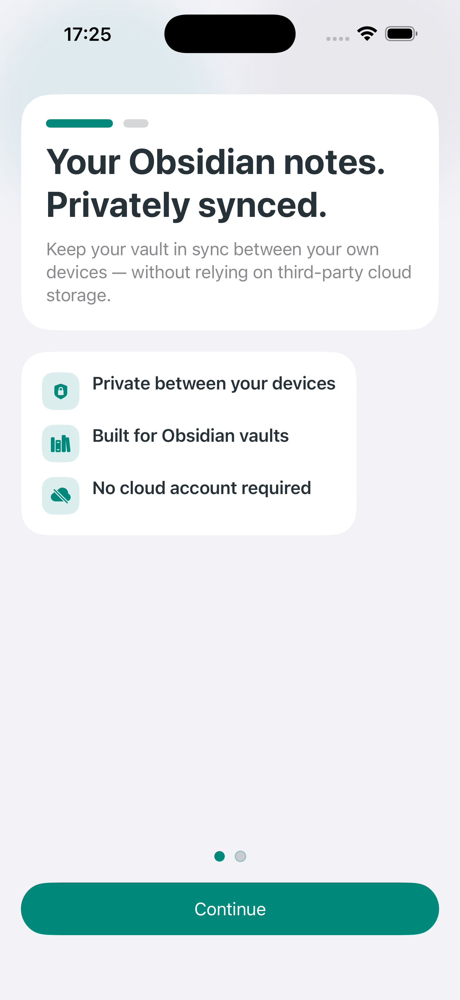

<div align="center">


# [VaultSync](https://apps.apple.com/app/vaultsync/id6761845197)

**Self-hosted Obsidian vault sync for iPhone and iPad — powered by Syncthing.**<br>
Your notes, your devices, your server. No managed note-sync cloud required.

<a href="https://apps.apple.com/app/vaultsync/id6761845197">
  
</a>

<br>

[](https://github.com/psimaker/vaultsync/stargazers)
[](https://github.com/psimaker/vaultsync/network)
[](https://github.com/psimaker/vaultsync/graphs/contributors)
[](LICENSE)

[](https://github.com/psimaker/vaultsync/actions/workflows/ci.yml)
[](https://github.com/psimaker/vaultsync/commits)

[](https://developer.apple.com/ios/)
[](https://swift.org)
[](https://developer.apple.com/xcode/)
[](https://github.com/psimaker/vaultsync/issues)
[](https://github.com/psimaker/vaultsync/pulls)

</div>

---

<p align="center">
  
  
</p>

---

## Why VaultSync?

VaultSync is the missing iOS bridge for people who already trust Syncthing with their Obsidian vault.

If your notes already live on your own Mac, Linux machine, NAS, or homeserver, VaultSync lets your iPhone or iPad join that setup without moving your vault into iCloud, Dropbox, or a managed note-sync cloud.

VaultSync syncs directly into Obsidian’s iOS sandbox, so your vault appears where Obsidian expects it.

**Built for:**

- Obsidian users who want self-hosted iOS sync
- Syncthing users who already sync notes across desktop and server
- Homelab and NAS setups
- Privacy-conscious Markdown users
- People who want their notes on their own devices

VaultSync is independent and is not affiliated with Obsidian or Syncthing.

---

## The honest sync promise

iOS does not allow third-party apps to run an always-on sync daemon in the background.

VaultSync is designed around that limitation instead of hiding it.

**What you can expect:**

- **Server → iPhone/iPad:** near-realtime incoming sync when Cloud Relay silent pushes are delivered
- **iPhone/iPad → Server:** most reliable when VaultSync is opened
- **Background refresh:** may help opportunistically, but iOS controls when and whether it runs

The honest product promise is:

> **Near-realtime incoming sync to iPhone. Reliable outgoing sync when VaultSync is opened.**

---

## What VaultSync does

- Syncs Obsidian vaults directly into Obsidian’s iOS folder
- Uses Syncthing under the hood
- Pairs with your desktop/server via QR code
- Works with Mac, Linux, NAS, and homelab Syncthing setups
- Includes Markdown conflict resolution
- Shows sync activity, diagnostics, and common setup issues
- Supports optional Cloud Relay wake-ups for faster server-to-iPhone updates
- Requires no account, no analytics SDK, and no tracking

---

## What VaultSync is not

VaultSync is not a hosted note-sync service.

It does not store your notes, index your vault, or proxy your Markdown files through a cloud backend.

VaultSync is also not a magic always-on Syncthing daemon for iOS. Apple’s background execution model does not allow that. Instead, VaultSync combines foreground sync, iOS background refresh, and optional silent push wake-ups to make Syncthing-based Obsidian sync practical on iPhone and iPad.

---

## What’s New — v1.1.0

> **Calmer First Launch** — First-run onboarding is now a short 2-screen introduction. Setup itself happens on the VaultSync home screen, where the real device, vault, and sync controls already live.
>
> **Setup Status in Settings** — The old setup guide is now a live status and troubleshooting view that highlights what is ready, what still needs attention, and where to fix it.
>
> **Pending Shares Need Action** — A waiting vault offer no longer looks finished. Vault syncing is only marked ready once at least one vault is actually active.
>
> **Cleaner Settings** — The old discovery controls are gone, reducing noise in Settings while leaving discovery enabled by default.
>
> **Localized Setup Flow** — The refreshed onboarding and setup-status copy is now available in English, German, and Simplified Chinese.
>
> **iOS 18+** — VaultSync now supports iOS/iPadOS 18 and later.

See [CHANGELOG.md](CHANGELOG.md) for full details.

---

## Features

<table>
<tr>
<td width="50%" valign="top">

### Syncthing-powered sync

VaultSync uses Syncthing to sync your vault between your own devices over LAN or the Internet.

### Obsidian-first design

VaultSync syncs directly into Obsidian’s iOS sandbox. Open Obsidian and your vault is where it should be.

### Calm onboarding, real setup

A short first-run onboarding explains the flow, and the actual setup happens on the home screen where you can connect Obsidian, pair devices, accept shares, and monitor sync.

### Markdown conflict resolver

When files conflict, VaultSync shows side-by-side Markdown diffs so you can choose the right version with confidence.

### Sync activity timeline

See what is syncing, when it synced, and where issues may have happened.

### No note cloud

Your notes sync between your own devices. VaultSync does not require a managed note-sync cloud, account, analytics SDK, or tracking.

</td>
<td width="50%" valign="top">

### Optional Cloud Relay

Cloud Relay can wake your iPhone when your server has changes, making incoming server-to-iPhone sync feel near-realtime.

### vaultsync-notify sidecar

A lightweight Docker container watches Syncthing on your server and signals the relay when your iPhone should wake up.

### Sync issues panel

Actionable diagnostics help you understand and fix common setup and runtime issues without guessing.

### Relay diagnostics

Built-in checks help you confirm whether Cloud Relay, APNs, and your notify sidecar are working correctly.

### iOS background-aware sync

VaultSync supports iOS background execution where available, but never claims to run permanently in the background.

### Accessibility

VoiceOver and Dynamic Type support are included throughout the app.

</td>
</tr>
</table>

---

## How it works

```text
┌──────────────┐     Syncthing protocol      ┌──────────────────┐
│  Your Mac /  │◄───────────────────────────►│    VaultSync      │
│  Linux / NAS │     LAN or Internet          │    iOS / iPadOS   │
│  + Syncthing │                              │                  │
└──────┬───────┘                              │  Syncs directly   │
       │                                      │  into Obsidian’s  │
       │                                      │  iOS sandbox      │
       │                                      └────────▲─────────┘
       │                                               │
       │  Optional                                     │
       │  vaultsync-notify                             │
       │  Docker sidecar                               │
       │                                               │
       ▼                                               │
┌──────────────────┐        APNs silent push           │
│ relay.vaultsync  │───────────────────────────────────┘
│      .eu         │        wake-up signal only
└──────────────────┘
```

1. **Syncthing** runs on your desktop, server, NAS, or homelab device.
2. **VaultSync** runs on your iPhone or iPad and syncs files into Obsidian’s iOS sandbox.
3. **vaultsync-notify** is an optional Docker sidecar that watches your Syncthing instance for real outgoing change markers.
4. **Cloud Relay** sends a silent push wake-up to your iPhone when your server has new changes.
5. **VaultSync wakes up** and pulls changes from your own Syncthing device.
6. **Local iPhone edits** sync most reliably when you open VaultSync.

---

## Cloud Relay privacy

Cloud Relay is not a note cloud.

It does not sync, store, read, proxy, or index your Markdown files. It only helps wake your iPhone when your own server has changes waiting.

The relay never receives:

- note content
- Markdown text
- filenames
- folder names
- vault structure
- vault metadata

The relay only handles the minimum routing information required to deliver wake-up signals, such as device registration and push delivery data.

For details, see [PRIVACY.md](PRIVACY.md).

---

## Cloud Relay vs. no relay

VaultSync works without Cloud Relay.

Without Cloud Relay, you can open VaultSync to trigger sync manually. iOS background refresh may also run opportunistically, but it is not guaranteed and does not run on a fixed schedule.

Cloud Relay improves the experience for server-side changes:

| Scenario | Without Cloud Relay | With Cloud Relay |
|---|---|---|
| Server changes while iPhone is locked | Syncs when VaultSync is opened or iOS refreshes opportunistically | Relay can wake VaultSync via silent push |
| iPhone edits need to go back to server | Most reliable when VaultSync is opened | Still most reliable when VaultSync is opened |
| Notes pass through VaultSync servers | No | No |
| File names pass through VaultSync servers | No | No |
| Requires subscription | No | Yes, via in-app purchase |

---

## Getting started

### 1. Install VaultSync

Download VaultSync from the [App Store](https://apps.apple.com/app/vaultsync/id6761845197).

### 2. Connect your Syncthing device

Open VaultSync and scan your desktop/server Syncthing Device ID via QR code, or enter it manually.

Then accept the connection on your desktop/server Syncthing instance.

### 3. Sync your vault

VaultSync detects Obsidian vaults on iOS. Select the vault you want to sync, connect it to your Syncthing share, and let the initial sync complete.

Once files are synced, open Obsidian on iOS. Your vault should appear where Obsidian expects it.

### 4. Enable Cloud Relay

Cloud Relay is optional, but recommended if you want faster server-to-iPhone updates.

Subscribe inside the app, then set up the notify container on your homeserver:

```bash
curl -fsSL https://raw.githubusercontent.com/psimaker/vaultsync/main/notify/scripts/bootstrap.sh | bash
```

The script auto-detects your Syncthing instance, configures the container, and starts it.

---

## Manual Docker Compose setup

If you prefer to configure the notify sidecar manually, add this to your existing `docker-compose.yml`:

```yaml
vaultsync-notify:
  image: ghcr.io/psimaker/vaultsync-notify:latest
  environment:
    SYNCTHING_API_URL: http://syncthing:8384
    SYNCTHING_API_KEY: your-syncthing-api-key
    RELAY_URL: https://relay.vaultsync.eu
    RELAY_API_KEY: your-relay-api-key
```

See [notify/README.md](notify/README.md) for full configuration options.

---

## Requirements

| Requirement | Details |
|---|---|
| iPhone or iPad | iOS/iPadOS 18 or later |
| Obsidian | Installed on iOS/iPadOS |
| Syncthing | Running on a Mac, Linux machine, NAS, or homeserver |
| Cloud Relay | Optional, available via in-app purchase |
| vaultsync-notify | Optional Docker sidecar for server-side wake-ups |

---

## iOS background limitation

iOS does not allow third-party apps like VaultSync to run an always-on sync daemon in the background.

That means:

- **Server → iPhone/iPad** can be near-realtime when Cloud Relay silent pushes are delivered.
- **iPhone/iPad → Server** should be treated as foreground-first.
- **Opening VaultSync** is the reliable way to push local iPhone edits back to your homeserver.
- **Background App Refresh** may help sometimes, but iOS controls when it runs.
- **Silent pushes** can be throttled or delayed by iOS depending on battery, network, system state, and usage patterns.

VaultSync is built to be honest about those constraints.

---

## Self-hosted relay

A fully self-hosted relay option, replacing `relay.vaultsync.eu` with your own relay server, is planned for a future release.

Until then, VaultSync works in two modes:

1. **Without relay:** open VaultSync to sync manually, with opportunistic iOS background refresh where available.
2. **With hosted Cloud Relay:** use silent push wake-ups for faster server-to-iPhone sync.

---

## Technical details

| | |
|---|---|
| Platform | iOS/iPadOS 18+ |
| Language | Swift 6, SwiftUI |
| Sync engine | Syncthing v2.x via Go/gomobile `.xcframework` |
| Background execution | `BGAppRefreshTask` + `BGContinuedProcessingTask` (iOS 26+ when available) |
| Push wake-ups | APNs silent notifications via Cloud Relay |
| Notify sidecar | Docker container for homeserver/NAS setups |
| License | MPL-2.0 |

---

## Building from source

### Requirements

- Xcode 26+
- Go 1.26+
- gomobile
- XcodeGen
- Make

### Build

```bash
git clone https://github.com/psimaker/vaultsync.git
cd vaultsync

# Patch vendored dependencies and build the Go xcframework
cd go
make patch
make xcframework
cd ..

# Generate and open the Xcode project
cd ios
xcodegen generate
open VaultSync.xcodeproj
```

See [docs/setup.md](docs/setup.md) for detailed build instructions.

---

## Project structure

```text
├── ios/                  # Swift/SwiftUI iOS app
├── go/                   # Go bridge: gomobile → .xcframework
├── notify/               # vaultsync-notify Docker container
├── docs/                 # Architecture, setup, and troubleshooting docs
└── .github/workflows/    # CI pipeline
```

---

## Troubleshooting

Common issues are documented here:

- [docs/troubleshooting.md](docs/troubleshooting.md) — Common runtime failures and exact fixes
- [notify/README.md](notify/README.md) — Notify sidecar setup and diagnostics
- [docs/setup.md](docs/setup.md) — Build and development setup

If you find a bug, please open an issue with:

- iOS/iPadOS version
- VaultSync version
- Syncthing version on your server/desktop
- Whether Cloud Relay is enabled
- Whether `vaultsync-notify` is running
- Relevant logs or screenshots

---

## Contributing

Contributions are welcome.

Please follow the project conventions:

- Swift API Design Guidelines
- Swift strict concurrency where applicable
- Standard Go conventions
- Conventional Commits
- Clear PR descriptions

Useful docs:

- [docs/setup.md](docs/setup.md) — Build instructions
- [docs/architecture.md](docs/architecture.md) — Codebase structure
- [docs/troubleshooting.md](docs/troubleshooting.md) — Common runtime failures and exact fixes

---

## Acknowledgments

VaultSync is built on top of these projects:

| Project | Description |
|---|---|
| [Syncthing](https://syncthing.net/) | The open-source file synchronization program powering VaultSync |
| [gomobile](https://github.com/golang/mobile) | Go on mobile, enabling the embedded sync engine |

VaultSync is designed for [Obsidian](https://obsidian.md), the powerful knowledge base for local Markdown files.

VaultSync is an independent project and is not affiliated with, endorsed by, or sponsored by Obsidian or Syncthing.

---

## License

[MPL-2.0](LICENSE) — You may freely use, modify, and distribute this software under the terms of the Mozilla Public License 2.0.
