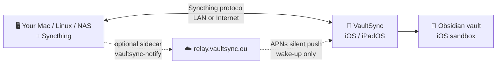

<div align="center">


# [VaultSync](https://apps.apple.com/app/vaultsync/id6761845197)

**Self-hosted Obsidian vault sync for iPhone and iPad.**<br>
Your notes sync peer-to-peer over Syncthing, straight into Obsidian's iOS sandbox — no note cloud, no account, no tracking.

<a href="https://apps.apple.com/app/vaultsync/id6761845197">
  
</a>

<br><br>

[](https://github.com/psimaker/vaultsync/stargazers)
[](LICENSE)
[](https://developer.apple.com/ios/)
[](https://github.com/psimaker/vaultsync/actions/workflows/ci.yml)


</div>

---

## 🔭 Why VaultSync

- **Peer-to-peer & private** — syncs directly between your own devices over [Syncthing](https://syncthing.net/). No note cloud, no account, no tracking.
- **Lands in Obsidian** — files sync into Obsidian's iOS sandbox, where the app already looks for them.
- **Pair by QR, resolve conflicts** — connect your server in seconds; settle Markdown conflicts with side-by-side diffs.
- **Server changes wake your iPhone** — optional Cloud Relay nudges the app the moment your server updates, so incoming notes land even while it's closed. An activity timeline and diagnostics show exactly what synced.

*VoiceOver and Dynamic Type throughout. Localized in English, German, Spanish, and Simplified Chinese. Independent project — not affiliated with Obsidian or Syncthing.*

---

## 🧭 How it works



Syncthing runs on a machine you keep on; VaultSync joins as a peer and syncs into Obsidian. The optional sidecar + Cloud Relay wake your iPhone when the server changes.

---

## 🚀 Quick start

1. **Install** VaultSync from the [App Store](https://apps.apple.com/app/vaultsync/id6761845197).
2. **Pair your server** — scan its Syncthing Device ID by QR (or paste it), then accept the connection in that Syncthing instance.
3. **Sync your vault** — VaultSync detects your Obsidian vaults, connects the share, and runs the first sync. Open Obsidian; your notes are there.
4. **(Optional)** Enable **Cloud Relay** for faster server→iPhone updates — see below.

---

## ☁️ Cloud Relay (optional)

Without it, VaultSync pulls server changes when you open the app. **With it, your iPhone wakes on its own the moment your server changes** — notes from your other devices land even while VaultSync is closed.

Setup is one paste-and-go step, and it switches itself on:

1. **Subscribe** in the app — monthly or yearly, at your App Store's local price.
2. **Paste the command** VaultSync gives you onto the computer or NAS that hosts your vault. There's **no API key to copy** — the helper reads what it needs from Syncthing itself.
3. **Done.** The helper wakes your iPhone once on startup, and VaultSync flips to **Cloud Relay active** by itself.

```bash
# VaultSync generates this for you — paste it on the machine that runs Syncthing
docker run -d --name vaultsync-notify --restart unless-stopped \
  --network host \
  -v /PATH/TO/syncthing:/config:ro \
  -e SYNCTHING_CONFIG=/config/config.xml \
  -e RELAY_URL=https://relay.vaultsync.eu \
  ghcr.io/psimaker/vaultsync-notify:latest
```

Replace `/PATH/TO/syncthing` with your Syncthing config folder — that's the only edit. Prefer Docker Compose, or on a NAS? The [full guide](notify/README.md) covers both.

**Private by design:** the relay only ever sees the Syncthing Device ID and APNs token needed to route a wake-up — never your notes, file or folder names, or vault structure ([PRIVACY.md](PRIVACY.md)). Incoming `server → iPhone` changes arrive near-realtime, usually within seconds; sending from iPhone is most reliable with VaultSync open. A self-hosted relay is on the roadmap.

---

## 📋 Requirements

| Requirement | Details |
|---|---|
| iPhone / iPad | iOS / iPadOS 18 or later |
| Obsidian | Installed on iOS / iPadOS |
| Syncthing | Running on a Mac, Linux machine, NAS, or homeserver |
| Cloud Relay | Optional — monthly or yearly in-app subscription |
| vaultsync-notify | Optional Docker sidecar for server-side wake-ups |

---

## 🔨 Build from source

Requires **Xcode 26+**, **Go 1.26+**, **gomobile**, **XcodeGen**, **Make**.

```bash
git clone https://github.com/psimaker/vaultsync.git && cd vaultsync
cd go && make patch && make xcframework && cd ..   # Go xcframework (~160 MB, bundles Syncthing)
cd ios && xcodegen generate && open VaultSync.xcodeproj
```

Full build, signing, and test steps: [docs/setup.md](docs/setup.md).

| | |
|---|---|
| Platform | iOS / iPadOS 18+ |
| Language | Swift 6, SwiftUI |
| Sync engine | Syncthing 2.x via Go/gomobile `.xcframework` |
| Background | `BGAppRefreshTask` + `BGContinuedProcessingTask` (iOS 26+ when available) |
| Push | APNs silent push via Cloud Relay |
| License | [MPL-2.0](LICENSE) |

---

## 📚 Documentation

| Doc | What it covers |
|---|---|
| [docs/setup.md](docs/setup.md) | Build and development setup |
| [docs/troubleshooting.md](docs/troubleshooting.md) | Common failures and exact fixes |
| [docs/architecture.md](docs/architecture.md) | Codebase structure and sync strategy |
| [docs/relay-spec.md](docs/relay-spec.md) | Cloud Relay protocol reference |
| [notify/README.md](notify/README.md) | Notify sidecar setup and diagnostics |
| [PRIVACY.md](PRIVACY.md) · [TERMS.md](TERMS.md) | Privacy policy and license terms |

Filing a bug? Include your iOS and VaultSync versions, your server's Syncthing version, whether Cloud Relay and `vaultsync-notify` are running, and relevant logs or screenshots.

---

## License & acknowledgments

[MPL-2.0](LICENSE) — use, modify, and distribute under the Mozilla Public License 2.0.

Built on [Syncthing](https://syncthing.net/) (the file-sync engine) and [gomobile](https://github.com/golang/mobile) (which embeds it on iOS), for [Obsidian](https://obsidian.md). VaultSync is independent and not affiliated with, endorsed by, or sponsored by Obsidian or Syncthing.
